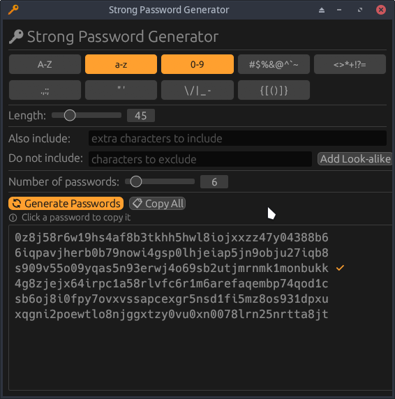

[](https://github.com/Antidote1911/deadpool/blob/master/LICENSE-MIT)
[](https://www.rust-lang.org/)
[](https://github.com/Antidote1911/deadpool/actions/workflows/release.yml)
[](https://github.com/Antidote1911/deadpool/actions/workflows/release.yml)
[](https://github.com/Antidote1911/deadpool/releases/latest)

> [English version](README.md)

# 🔑 Deadpool et Deadpool-CLI

Ce dépôt contient trois composants : **deadpool-core**, une bibliothèque Rust pour générer des mots de passe sécurisés ; **deadpool-cli**, un outil en ligne de commande ; et **deadpool**, une interface graphique — les deux construits par-dessus la bibliothèque core.



## Télécharger les binaires pré-compilés

Des binaires pré-compilés pour Linux, Windows et macOS (Universal) sont disponibles sur la [page des releases](https://github.com/Antidote1911/deadpool/releases/latest).

| Plateforme | Archive |
|---|---|
| Linux x86\_64 | `deadpool-{version}-linux-x86_64.AppImage` |
| Windows x86\_64 (portable) | `deadpool-{version}-win-portable.zip` |
| Windows x86\_64 (installeur) | `deadpool-{version}-win-setup.exe` |
| macOS Universal (arm64 + x86\_64) | `deadpool-{version}-universal-macos.dmg` |

L'AppImage Linux et le zip portable Windows contiennent chacun deux binaires :
- `deadpool-cli` / `deadpool-cli.exe` — outil en ligne de commande
- `deadpool` / `deadpool.exe` — interface graphique

## Installation sur Arch Linux

Trois PKGBUILDs sont fournis dans `packaging/archlinux/`.

**AppImage** (`PKGBUILD-AppImage`) — télécharge l'AppImage pré-compilée, aucune compilation requise :

```bash
mkdir -p ~/builds/deadpool-appimage && cd ~/builds/deadpool-appimage
curl -O https://raw.githubusercontent.com/Antidote1911/deadpool/master/packaging/archlinux/PKGBUILD-AppImage
mv PKGBUILD-AppImage PKGBUILD
makepkg -si
```

Installe `/opt/deadpool/deadpool.AppImage` et crée les symlinks `/usr/bin/deadpool` et `/usr/bin/deadpool-cli`. Nécessite `fuse2`.

**Version stable** (`PKGBUILD`) — compile depuis la dernière version taguée sur GitHub :

```bash
mkdir -p ~/builds/deadpool && cd ~/builds/deadpool
curl -O https://raw.githubusercontent.com/Antidote1911/deadpool/master/packaging/archlinux/PKGBUILD
makepkg -si
```

**Version Git** (`PKGBUILD-git`) — compile depuis le dernier commit sur `master`, s'installe sous le nom `deadpool-git` (en conflit avec `deadpool`) :

```bash
mkdir -p ~/builds/deadpool-git && cd ~/builds/deadpool-git
curl -O https://raw.githubusercontent.com/Antidote1911/deadpool/master/packaging/archlinux/PKGBUILD-git
mv PKGBUILD-git PKGBUILD
makepkg -si
```

Ou clonez le dépôt et utilisez les fichiers directement :

```bash
git clone https://github.com/Antidote1911/deadpool
cd deadpool/packaging/archlinux
# pour la version stable :
makepkg -si -p PKGBUILD
# pour la version git :
makepkg -si -p PKGBUILD-git
```

Les deux paquets installent :
- `/usr/bin/deadpool-cli` — outil en ligne de commande
- `/usr/bin/deadpool` — interface graphique
- Une entrée `.desktop` et une icône pour l'interface graphique

## Utilisation de la crate Deadpool

```rust
use deadpool_core::Pool;

let mut pool = Pool::new();
pool.extend_from_uppercase();
pool.extend_from_digits();
pool.extend_from_dashes();
pool.extend_from_string("@é=")?;
pool.exclude_chars("0Oo1iIlL5S"); // exclure les caractères ambigus

let password = pool.generate(25)?;
```

## Jeux de caractères

| Option | Caractères |
|---|---|
| `-u` / `--uppercase` | `ABCDEFGHIJKLMNOPQRSTUVWXYZ` |
| `-l` / `--lowercase` | `abcdefghijklmnopqrstuvwxyz` |
| `-d` / `--digits` | `0123456789` |
| `-b` / `--braces` | `()[]{}` |
| `-p` / `--punctuation` | `.,:;` |
| `-q` / `--quotes` | `"'` |
| `--dashes` | `-/\_\|` |
| `-m` / `--math` | `!*+<=>?` |
| `--logograms` | `#$%&@^\`~` |

## Utilisation de deadpool-cli

Les mots de passe générés contiennent toujours au moins un caractère de chaque groupe sélectionné.
Sans argument, le mot de passe généré fait 10 caractères et utilise des lettres minuscules et des chiffres.

### Utiliser la CLI via l'AppImage Linux

L'AppImage embarque à la fois l'interface graphique et la CLI. La méthode recommandée est d'utiliser le script d'installation fourni, qui télécharge la dernière release sous un nom sans version et crée deux symlinks — les mises à jour ne cassent ni vos habitudes ni vos scripts :

```bash
curl -sL https://raw.githubusercontent.com/Antidote1911/deadpool/master/packaging/linux/install.sh | bash
```

Cela installe dans `~/.local/bin/` :
- `deadpool` — lance l'interface graphique
- `deadpool-cli` — lance directement l'outil en ligne de commande

```bash
deadpool-cli -ld -L 20
deadpool-cli --count 3 -L 30 -ldm --include "@éèà"
deadpool-cli --help
```

**Installation manuelle** — si vous préférez placer l'AppImage vous-même :

```bash
# Sauvegarder l'AppImage sans numéro de version
mv deadpool-*-linux-x86_64.AppImage ~/.local/bin/deadpool.AppImage
chmod +x ~/.local/bin/deadpool.AppImage

# Créer les symlinks
ln -sf deadpool.AppImage ~/.local/bin/deadpool
ln -sf deadpool.AppImage ~/.local/bin/deadpool-cli
```

L'AppImage accepte aussi `--cli` comme premier argument si vous l'invoquez directement :

```bash
./deadpool.AppImage --cli -ld -L 20
```

### Exemples

```
# équivalent à ./deadpool-cli -ld -L 10
./deadpool-cli
uabhbunf0q
```

Générer 3 mots de passe de 30 caractères avec minuscules, chiffres, symboles mathématiques, et inclure `@ é è à % M` :
```
./deadpool-cli --count 3 -L 30 -ldm --include "@éèà%M"
0c3mi<l1=Ma6xfujp>ddc3%%*n76èp
3>j+%=?5k*ubyd@p+=wior4a@qhiàu
tz6z99iwà1h!s+Mg4iv5t%@%5kenq8
```

Générer un mot de passe de 30 caractères avec uniquement des chiffres, en excluant 0–5 :
```
./deadpool-cli -d -L 30 --exclude 012345
879866968679799766976867796776
```

> L'option `--exclude` a priorité sur `--include`. Un caractère ajouté avec `--include` est toujours supprimé par `--exclude`.

Aide complète :
```
./deadpool-cli -h

🔑 Random password generator CLI

Usage: deadpool-cli [OPTIONS]

Options:
  -u, --uppercase          Use UPPERCASE letters [A-Z]
  -l, --lowercase          Use lowercase letters [a-z]
  -d, --digits             Use digits [0-9]
  -b, --braces             Use braces [()[]{}]
  -p, --punctuation        Use punctuation [.,:;]
  -q, --quotes             Use quotes ["']
      --dashes             Use dashes [-/\_|]
  -m, --math               Use math symbols [!*+<=>?]
      --logograms          Use logograms [#$%&@^`~]
  -C, --count <NUMBER>     Number of passwords to generate [default: 1]
  -L, --length <NUMBER>    Sets the required password length [default: 10]
      --output <OUTPUT>    Output to a txt file
      --exclude <EXCLUDE>  Exclude chars
      --include <INCLUDE>  Include chars
  -h, --help               Print help
  -V, --version            Print version

Si vous ne spécifiez aucun des drapeaux [--uppercase, --lowercase, --digits], alors les minuscules et les chiffres seront utilisés.
```

## Compiler depuis les sources

Clonez le dépôt et compilez avec Cargo :
```
git clone https://github.com/Antidote1911/deadpool
cd deadpool
cargo build --release
```

Les binaires sont générés dans `target/release/`.
