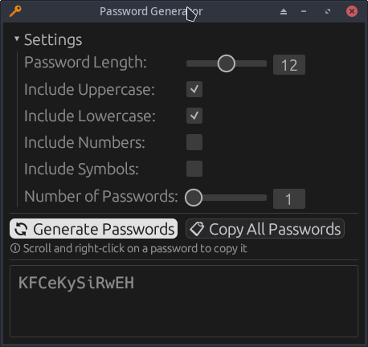

[](https://github.com/Antidote1911/deadpool/blob/master/LICENSE-MIT)
[](https://www.rust-lang.org/)
[](https://github.com/Antidote1911/deadpool/actions/workflows/tests.yml)
[](https://github.com/Antidote1911/deadpool/actions/workflows/release.yml)
[](https://github.com/Antidote1911/deadpool/releases/latest)

# 🔑 Deadpool and Shuffle

**Deadpool** is a Rust crate to generate secure passwords. **Shuffle** is a command-line application and a graphical interface built on top of it.



## Download pre-built binaries

Pre-built binaries for Linux, Windows, and macOS (Universal) are available on the [Releases page](https://github.com/Antidote1911/deadpool/releases/latest).

| Platform | Archive |
|---|---|
| Linux x86\_64 | `shuffle-linux-x86_64.tar.gz` |
| Windows x86\_64 | `shuffle-windows-x86_64.zip` |
| macOS Universal (arm64 + x86\_64) | `shuffle-macos-universal.tar.gz` |

Each archive contains two binaries:
- `shuffle` / `shuffle.exe` — command-line tool
- `shuffle_gui` / `shuffle_gui.exe` — graphical interface

## Usage for Deadpool crate

```rust
use deadpool::*;

let mut pool = Pool::new();
pool.extend_from_uppercase();
pool.extend_from_digits();
pool.extend_from_dashes();
pool.extend_from_string("@é=");
pool.exclude_chars("0Oo1iIlL5S"); // exclude ambiguous chars

let password = pool.generate(25);
```

## Usage for shuffle CLI application

The generated passwords always contain at least one character from each selected group.
Without arguments, the generated password is 10 characters long and uses lowercase letters and numbers.

```
# equivalent to ./shuffle -ld -L 10
./shuffle
uabhbunf0q
```

Generate 3 passwords with 30 chars using lowercase, digits, math symbols, and include `@ é è à % M`:
```
./shuffle --count 3 -L 30 -ldm --include "@éèà%M"
0c3mi<l1=Ma6xfujp>ddc3%%*n76èp
3>j+%=?5k*ubyd@p+=wior4a@qhiàu
tz6z99iwà1h!s+Mg4iv5t%@%5kenq8
```

Generate a password with 30 chars using only digits, excluding 0–5:
```
./shuffle -d -L 30 --exclude 012345
879866968679799766976867796776
```

> The `--exclude` option takes precedence over `--include`. A character added with `--include` is always removed by `--exclude`.

Full help:
```
./shuffle -h

🔑 Random password generator

Usage: shuffle [OPTIONS]

Options:
  -u, --uppercase          Use UPPERCASE letters [A-Z]
  -l, --lowercase          Use lowercase letters [a-z]
  -d, --digits             Use digits [0-9]
  -b, --braces             Use special symbols [*&^%$#@!~]
  -p, --punctuation
  -q, --quotes
      --dashes
  -m, --math
      --logograms
  -C, --count <NUMBER>     Number of passwords to generate [default: 1]
  -L, --length <NUMBER>    Sets the required password length [default: 10]
      --output <OUTPUT>    Output to a txt file
      --exclude <EXCLUDE>  Exclude chars
      --include <INCLUDE>  Include chars
  -h, --help               Print help
  -V, --version            Print version
```

## Build from source

Clone the repo and build with Cargo:
```
git clone https://github.com/Antidote1911/deadpool
cd deadpool
cargo build --release
```

Binaries are written to `target/release/`.
